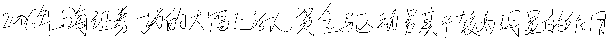
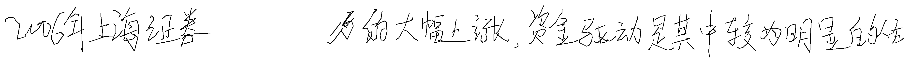
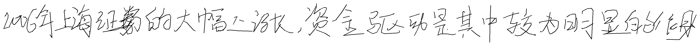
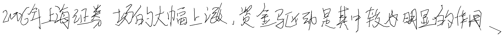
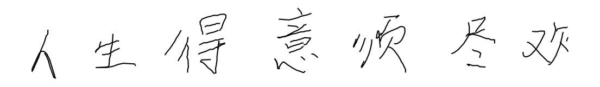
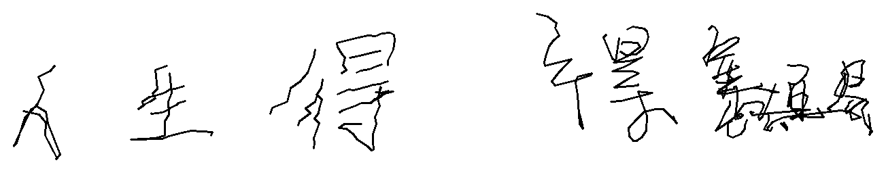
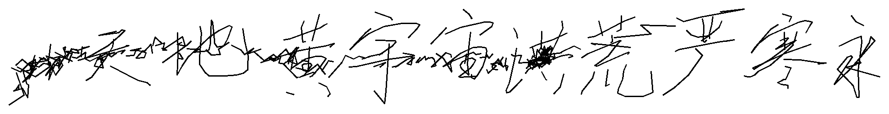

# DiffInk 论文边界信息泄漏问题分析

**目标论文**：DiffInk — A Glyph- and Style-Aware Latent Diffusion Transformer for Chinese Online Handwriting Generation（ICLR 2026）
**官方仓库**：https://github.com/awei669/DiffInk

---

## 摘要

DiffInk 主要问题：

1. **词表只有 2648 字**（`All_zi.json`），中文常用字覆盖有限，超出词表的字直接报错。
2. **长度信息泄漏**：测试时模型预先知道答案的形状——输入序列总长 T、DiT 要生成多少 latent、recon 输出长度，全部直接等于 GT 真实长度。模型不需要学"该写多长"。
3. **边界 latent 泄漏**：VAE 把整段 GT（含 target）一起编码，非因果 conv 的感受野让 cond 区**最后 1 个 latent**（动态 mask 下是 latent[21]）编码了 target 起始处的笔迹。DiT 训练时学会读这个暗号生成 target——这是模型生成能力的关键，而不是文本 embedding。
4. **训练方式决定不可用于部署**：训练和测试都依赖"同序列前 30%"作 context；部署时 ref 和 target 来自不同序列，长度泄漏 + 边界泄漏同时消失，DiT 在边界处生成断裂、整体崩坏。
5. **推理计算资源消耗大**：Diffink本身是输出图片，6700多个字输出图像需要考虑输出多少张图，同时需要进行6700次的inksight（这里就差不多20分钟了）

---

## 1. 论文官方实现的关键代码

直接引用论文官方仓库 [`trainer/dit_trainer.py`](https://github.com/awei669/DiffInk/blob/main/trainer/dit_trainer.py)：

| 阶段 | 函数 | 关键行 | 代码 |
|---|---|---|---|
| 训练 | `train_dit_one_epoch` | L41 | `feat = vae.encode(data)[0]` |
| Tune | `tune_dit_one_epoch` | L131 | `feat = vae.encode(data)[0].permute(0, 2, 1)` |
| 验证 | `val_dit_one_batch` | L203 | `feat = vae.encode(data)[0].permute(0, 2, 1)` |
| 推理 | `infer_diffink` | L267 | `feat = vae.encode(data)[0].permute(0, 2, 1)` |

四处全部：

1. 把整条 GT 序列（含 target）丢进 VAE
2. `build_prefix_mask_from_char_points(prefix_ratio=0.3)` 仅在 latent 空间切 mask
3. **从未对输入 `data` 做任何 zero / mask 操作**

### 训练损失（line 66–70）

```python
x_pred = dit(x=x_t_cond, noise=x_t, text=text_idx, time=t,
             mask=latent_padding_mask, drop_text=..., drop_cond=...)
loss = F.mse_loss(x_pred, feat.permute(0, 2, 1), reduction="none")
mse_loss = loss[final_noise_mask.bool()].mean()    # 只在 suffix 区算 loss
```

DiT 的训练目标：**让 `x_pred[suffix] ≈ feat[suffix]`**。
而 `feat[suffix]` 就是"VAE 编码 target 笔迹"——模型本质上被训练为"读取 cond 中泄漏的 target 信息，复现 target 的 latent"。

### Validation / Inference 与训练完全一致

`val_dit_one_batch`（L181–243）和 `infer_diffink`（L245–305）的数据流与训练函数同源。**没有任何"测试时去掉泄漏"的开关**。

### Mask 函数本身不修改数据

[`utils/mask.py`](https://github.com/awei669/DiffInk/blob/main/utils/mask.py) 中 `build_prefix_mask_from_char_points` 仅返回 `latent_mask` / `latent_padding_mask` / `prefix_label_mask`，**不对输入 `data` 做任何处理**。整个 pipeline 中，`data` 自始至终是完整 GT。

---

## 2. 泄漏机制

### 2.1 InkVAE Encoder 是非因果 Conv1D

[`model/blocks.py`](https://github.com/awei669/DiffInk/blob/main/model/blocks.py) 的 Encoder：3 层 stride-2 + kernel=3 卷积 + ResidualStack，**总下采样 8×**，**双向 padding（非因果）**。每个 latent 实际有效感受野 ≈ 33–45 个输入位置（实测见 §2.3），同时看左右两侧。

### 2.2 数据流图

```
work_strokes (T=808, 含 prefix+target)
        │
        ▼
   VAE Encoder (3× stride-2 Conv1D)
        │
        ▼
   feat (T_lat=101, latent_dim=384)
        │
        ├─ feat[0:22] ──→ DiT cond（"style 条件"）
        │      其中 latent[21] (cond 区最后一个 token):
        │      ↑ 感受野跨过 prefix/target 边界 (175/8 ≈ 21.9)
        │      └── 编码了 target 起始处的笔迹信息（这就是边界泄漏）
        │
        └─ feat[22:]  ──→ MSE loss 监督目标
```

### 2.3 边界泄漏的具体规模

**一句话：cond 区共 22 个 latent，只有最后 1 个（latent[21]）真正泄漏。**

这条 31 字样本：T=808, prefix_end_pt=175（前 9 字结束于第 175 个输入点），动态 mask 算出 cond=`latent[0:22]`、suffix=`latent[22:101]`。

把 VAE 输入 target 区清零前后，每个 cond latent 的编码差异 L2：

| latent | L2 差异 | 含 target 信息？ |
|---|---:|---|
| 0..19 | 8–14 | ❌ 不含（背景噪声） |
| 20 | 14 | ⚠ 擦边（2 个 target 点） |
| **21** | **44** | ✅ **重度泄漏**（10 个 target 点） |

**为什么是 latent[21]？** VAE 是 8× 下采样的 conv，每个 latent 大致管 ±20 个输入位置。latent[21] 的中心在输入位置 168，向后能看到位置 184 — 这超过了 prefix/target 边界 175，所以这个 latent 的编码里混入了 target 起始处 10 个笔迹点的信息。其他 latent 的可视范围都没跨过 175，干净。

> 关于"L2 ≈ 8–14 是噪声"：VAE 有 GroupNorm，会让所有位置数值轻微耦合，所以即使一个 latent 完全不依赖 target，远处清零也会让它的编码飘 8-14；超过这个底就是真泄漏。详细的感受野实测过程见 [`measure_rf.py`](../measure_rf.py) 和 §A 附录。

### 2.4 Dynamic mask 原理

paper [`utils/mask.py`](https://github.com/awei669/DiffInk/blob/main/utils/mask.py) 把"前 30% 字"翻译成 latent 空间的 cond/suffix 切分，三层映射：

```
prefix_ratio=0.3 → 取 num_prefix = round(N×0.3) 个字
                 → prefix_end_pt = char_points_idx[num_prefix-1]   (输入下标)
                 → latent_mask 在 prefix_end_pt/8 处切分               (latent 下标)
```

每条样本的切分位置都不同（取决于字数和每字笔画数），所以**必须动态**：

| 字数 | T | dyn cond size |
|---:|---:|---:|
| 10 | ~400 | 15 |
| 20 | ~800 | 30 |
| 31 | 808 | **22** ← 本实验样本 |
| 50 | 1280 | 75 |

**边界向 prefix 倾斜**：下采样到 latent 时用 `(mean > 0.0)` 二值化——8 个输入位置里只要有 1 个在 prefix 内，整个 latent token 就算 cond。具体到 latent[21]（覆盖输入 [168, 176)）：175 之前 7 个点是 prefix → 7/8 > 0 → 划进 cond。**正是这条规则让感受野跨过 175 边界、吃到 10 个 target 点的 latent[21] 被划进 cond，构成 §2.3 的边界泄漏入口**。

### 2.5 不同长度样本下的处理

paper 训练/推理用的都是 val.h5 里的完整 GT，长度天然准确，不存在"凑长度"问题。

部署时（[handler.py](../handler.py)）只有 ref 笔迹和想写的 target 文字，没有 GT。handler 的做法：用 ref 算每字平均点数，乘以 total_chars 估算"应该有多长"。如果 ref 笔迹够长就直接切前 needed_pts 个点用，不够长就把 ref 循环平铺凑够。

不论切片还是平铺，**部署时 VAE 看到的 target 区都不是真 target 笔迹**——切片时是 ref 后半段的内容，平铺时是循环的 ref。这导致 §2.3 的边界泄漏机制失效：DiT 在训练时学会"读 cond 区最后那个 latent 拿 target 暗号"，部署时这个 latent 里装的却是 ref 内部某段的笔迹编码，**读到的是错的暗号，在边界处接不上**。

各样本实测的 cond/suffix 切分：

| 测试 | ref/tgt | T | T_lat | dyn cond | dyn suffix |
|---|---|---:|---:|---:|---:|
| paper（31 字 val.h5）| 同序列 | 808 | 101 | 22 | 79 |
| sentence（10s + 14t）| 不同序列 | 968 | 121 | 51 | 70 |
| inksight 真实手写（3s + 4t）| 不同序列 | 528 | 66 | 28 | 38 |
| short / v3（5s + 5t）| 不同序列 | 408 | 51 | 25 | 26 |
| long（5s + 16t）| 不同序列 | 856 | 107 | 25 | 82 |

cond size 完全跟样本特征走。

### 2.6 第二类泄漏：长度信息泄漏

paper 推理时模型在三个层面**预先就知道答案的形状**：

1. **输入序列总长度 T**：直接等于 val.h5 里的 GT 真实长度（[ValDataset.collate_fn](https://github.com/awei669/DiffInk/blob/main/dataset/vae_dataset.py#L247) 用 `max(seq.shape[0])` 取 GT）
2. **DiT 要生成多少 suffix latent**：等于 (GT 长度 − prefix_end_pt) / 8
3. **recon 输出长度**：被强制截断到 GT 长度（[infer_diffink:290](https://github.com/awei669/DiffInk/blob/main/trainer/dit_trainer.py#L290) `max_seq_len = mask[i].sum()`）

也就是说，paper 评测时模型不需要学"该写多长就停"——长度已经从 GT 里知道了，DDIM 生成的张量形状提前对齐到 GT，最终笔迹也按 GT 截断。

部署时这三个数都不知道，只能靠"ref 每字平均点数 × target 字数"估算总长。估算误差不仅会让 DiT 拿到与训练时不熟悉的 shape，更没法预知 target 每个字的真实笔画数 → 双重 OOD（边界泄漏失效 + 长度先验失效）。

---

## 3. 实验 A：严格泄漏隔离

### 3.1 实验设置

paper_orig 和 paper_noleak 唯一的差别是 **VAE 输入是否含 target**：paper_orig 喂完整 GT，paper_noleak 把 target 区清零成 pad value `[0,0,0,0,1]`。其余（work_strokes、char_points_idx、text、prefix_ratio、cond_mask、padding_mask、seed、模型权重）全部相同。

`padding_mask` 故意用未清零的 data 算，避免 DDIM 把 target 区当 padding 跳过。

脚本见 [`docs/test_expA_noleak.py`](./test_expA_noleak.py)。

### 3.2 关键结果：feat 逐 latent token 的 L2 差异

`||feat_orig[i] − feat_noleak[i]||_2`（i = 0..21，cond 区）：

```
latent[ 0.. 4]: 14.6  11.5  12.7  12.2  12.4
latent[ 5.. 9]: 12.3  11.3  10.9  11.7  11.6
latent[10..14]:  9.8   8.2  11.2  12.1  12.3
latent[15..19]:  9.1   8.5  11.1   8.9   7.6
latent[20..21]: 14.0  44.3      ← 断崖砸在 cond 区最后 1 个 token
```

latent[21] L2=44.3 相比 latent[20] (=14) 跳了 3.2×，正好对应 prefix/target 边界（175/8 ≈ 21.9）。其余 21 个 cond token 都在 8–14 噪声底，**只有这 1 个 token 真正承载边界泄漏**。

### 3.3 视觉对比（recon 图）

#### VAE 实际看到的输入

两组 `work_strokes` 数组本身相同（同一条 31 字 GT），区别只在喂给 VAE encode 时是否对 target 区做 zero-mask：

| paper_orig（VAE 看到完整 GT）| paper_noleak（VAE 只看到 prefix）|
|---|---|
|  |  |

右图后 78.3% 为空白（被替换成 pad value），这才是真实部署场景下 VAE 能看到的内容——模型只能看到 prefix 真迹（前 9 字 / 175 个输入点），target 区为空。

#### 生成结果（`recon.png`）

| paper_orig（含泄漏）| paper_noleak（堵住泄漏）|
|---|---|
|  |  |

### 3.4 实验结论

唯一变量是"VAE 输入是否含 target"，其他全等。cond 区 22 个 latent 中只有 latent[21] 一个真正承载泄漏（L2 从 ~14 暴涨到 44.3），堵住后生成在边界处直接断裂——**DiT 的生成能力实质依赖这 1 个 token**。

---

## 4. 补充实验：跨 pipeline 验证（原 compare 实验）

**做了什么**：把同一条 31 字样本喂给三个不同 pipeline，对比生成结果。

| 模式 | VAE 输入 | feat[cond] 是否含 target 信息 |
|---|---|---|
| **paper** | 完整 31 字 GT | ✅ 含（边界泄漏） |
| **tile** | 前 9 字 ref 循环平铺（部署式）| ❌ 不含 |
| **hybrid** | tile 管线 + 替换 cond 区 22 个 latent 为 paper 的 | ✅ 含（人为注入泄漏） |

**结果**：

| paper | tile | hybrid |
|---|---|---|
|  |  |  |

paper 完整生成；tile 崩成乱码；**hybrid 视觉上和 paper 几乎一样**。

**证明了什么**：cond 区 22 个 latent 里只有 latent[21] 一个真正含 target 信息（其他 21 个的感受野不到边界），仅注入这 1 个 token 就能把 tile 的崩坏输出修回 paper 级别质量——**DiT 跨 pipeline 都依赖这个边界 latent 里的 target 暗号**。

> 与 §3 的关系：§3 是"最小手术刀"（只动 VAE 输入，证明因果）；§4 是"换刀具"（整套 pipeline 换，证明效应可跨 pipeline 传递）。结论一致。

---

## 5. README 与实际任务定义的不一致

DiffInk 官方 README 把任务描述为：
> *"takes text and a style reference to directly output complete text lines"*

而实际 `val_dit.py` / `infer_diffink` 评测的任务是：
**"对同一句话，给前 30% 字的真笔迹，续写后 70% 字"**——一个 prefix continuation 任务，且前缀和目标来自同一序列。

repo 中**从未出现**"style ref 和 target text 来自不同句子"的评测设置。

---

## 6. 总结

- **两类泄漏**：边界 latent 编码泄漏（cond 区最后 1 个 latent[21] 编码 target 起始信息，§2.3/§3/§4）+ 长度信息泄漏（T、T_lat、seq_len 均直接来自 GT，§2.6）。
- **训练-部署 mismatch**：论文测试用同序列前 30%→70% 续写，两类泄漏自然存在；部署 ref/target 不同序列，两类泄漏同时消失，模型崩坏。
- **README 与实际任务不符**：宣称 style transfer，实测同序列 prefix continuation。

---

## 7. 复现说明

### 7.1 代码

- 实验 A 脚本：[`docs/test_expA_noleak.py`](./test_expA_noleak.py)
- 原 compare 脚本：项目根目录 [`test_val_h5.py`](../test_val_h5.py)
- 模型权重：与论文一致（VAE epoch 100 + DiT epoch 1）

### 7.2 运行

```bash
# 1. 下载 checkpoints (vae_epoch_100.pt + dit_epoch_1.pt)
python download_checkpoints.py

# 2. 准备 test_input.json (从 val.h5 任意取一条 31 字以上的样本即可)

# 3. 运行实验 A
python docs/test_expA_noleak.py \
    --test_input test_input.json \
    --output_dir test/test_outputs_expA_noleak \
    --seed 42

# 4. 运行原 compare 实验
python test_val_h5.py --mode compare \
    --output_dir test/test_outputs_val_h5_compare \
    --seed 42
```

### 7.3 输入样本规格

- 来源：DiffInk 官方 val.h5
- 样本：单条 31 字连续手写笔迹（writer_id 任意）
- `point_seq.shape = (802, 5)`，pad 至 808 → `T_lat = 101`
- `prefix_ratio = 0.3` → prefix_end_pt = 175 输入点（前 9 字）
- `cond_mask` 走 paper 原版动态算法：由 `prefix_ratio=0.3` + `char_points_idx[8]=175` 算出 → cond=latent[0:22], suffix=latent[22:101]（详见 [diffink/utils/mask.py](../diffink/utils/mask.py)）

---

## 8. 用户数据集上的部署测试（动态 mask 下）

为验证"边界泄漏在部署场景下消失 → 模型崩"这一推论，我们在两类用户数据集上跑 DiffInk 推理，全部使用 paper 原版动态 mask（`build_prefix_mask_from_char_points`，无任何硬编码覆盖）。

### 8.1 部署侧输入处理流程（[handler.py](../handler.py)）

部署时只有 ref 笔迹和 target 文字，没有 GT，handler 全凭 ref 估算：

1. **拼 full_text** = ref 前 num_style 字 + target 文字；`prefix_ratio = num_style / total_chars`（**通常 0.4–0.5，训练时是 0.3，分布漂移**）
2. **估算总长**：`avg_pts_per_char = ref 总点数 / ref 字数`，`needed_pts = avg_pts_per_char × total_chars`
3. **凑 work_strokes**：ref 够长就切前 needed_pts 个点；不够就循环平铺
4. **重建 char_points_idx**：前 num_style 个用 ref 真实边界，后 num_target 个在 [prefix_end_pt, needed_pts] 均匀估算
5. pad 到 8 的倍数 → VAE encode → DiT cond → DDIM → VAE decode（同 paper）

部署 vs paper 推理的关键差异：

| 项 | paper 推理 | handler 部署 |
|---|---|---|
| target 是否进 VAE | ✅ 完整 GT | ❌ 没有真 target，是 ref 切片/平铺 |
| 序列总长 T | GT 真实长度 | 估算 |
| target 字符边界 | GT 准确 | 均匀估算 |
| prefix_ratio | 0.3 | 0.4–0.5 |
| 边界 latent[21] 内容 | target 起始处的真笔迹编码 | ref 内部某段笔迹编码 → DiT 读到错暗号 |

### 8.2 InkSight 还原的真实手写

**输入**：真实手写图片 → TextIn 分字 → 每字 InkSight 提轨迹 → 拼成 5 元组
**reference_text** = `"人生得意须尽欢"`（7 字, T=523），**target_text** = `"意须尽欢"`（4 字, num_style=3）
**部署侧切分**：T_lat=66, dyn cond=28, dyn suffix=38（DiT 有 38 个 latent 自由生成）

#### 输入参考轨迹（InkSight 还原）


#### 生成结果（dynamic mask）


**观察**：
- 前 3 字"人生得"清晰（来自 cond 区 feat 的解码）
- 后 4 字"意须尽欢"崩成乱涂——尽管 DiT 有 38 个 latent 的生成空间，模型在 InkSight 还原 + 仅 3 字 style 这种极度 OOD 输入下无法生成可读笔迹

### 8.3 sentence: gfont style + 长 target text

**reference_text** = `"天地黄宇宙洪荒严寒永"`（10 字 gfont, T=402），**target_text** = `"春风又绿江南岸明月何时照我还"`（14 字, num_style=10）
**部署侧切分**：handler 把 work_strokes 平铺扩展到 T=964, T_lat=121, dyn cond=51, dyn suffix=70

#### 生成结果（dynamic mask）


**观察**：
- 前 5–7 字"天地黄宇宙"勉强可辨（cond 区解码）
- 后续 17–19 字（应是"洪荒严寒永春风又绿江南岸明月何时照我还"）全是糊乱码

### 8.4 结论

在 paper 原版动态 mask 下，**用户数据集（gfont / InkSight）的输出仍然崩**——根本原因是部署场景与论文训练/评测设置的多重 mismatch：

1. **边界泄漏失效（第一类泄漏消失）**：paper 训练/评测时 ref 与 target 来自同一序列，VAE encode 完整 GT，cond 区最后一个 latent（latent[21]）编码 target 起始信息；部署时 ref/target 是不同序列，handler 用 `tile/slice` 扩展 work_strokes，VAE 看到的 target 区是"循环的 ref 笔迹"或"ref 后半段"，不是真 target，**latent[21] 给的暗号变成"ref 内部某段的笔迹编码"，DiT 误读后在边界处接不上**
2. **长度先验失效（第二类泄漏消失）**：paper 推理时 T_lat 来自 GT 真实长度；部署时由 `avg_pts_per_char × total_chars` 估算，DiT 拿到的噪声张量形状不再是它训练时熟悉的"正好等于 GT 长度"，再加上估算误差
3. **输入分布漂移**：gfont 字间距/采样密度 ≈ CASIA 训练集的 1.5×，InkSight 还原引入识别误差
4. **prefix_ratio OOD**：训练用 0.3，部署用 0.42–0.5（由 num_style/total_chars 决定，通常更大）
