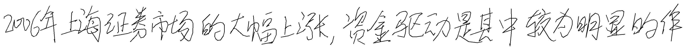
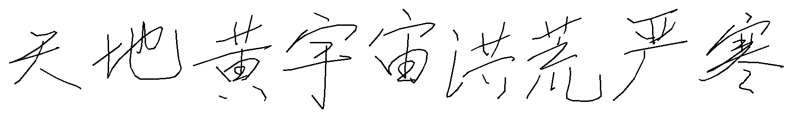
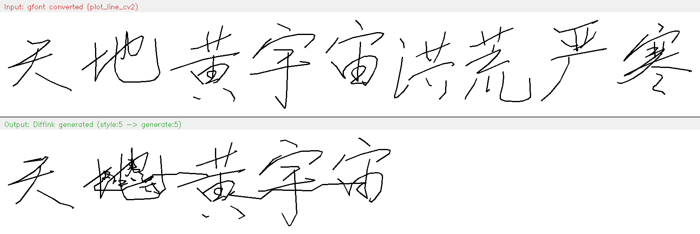
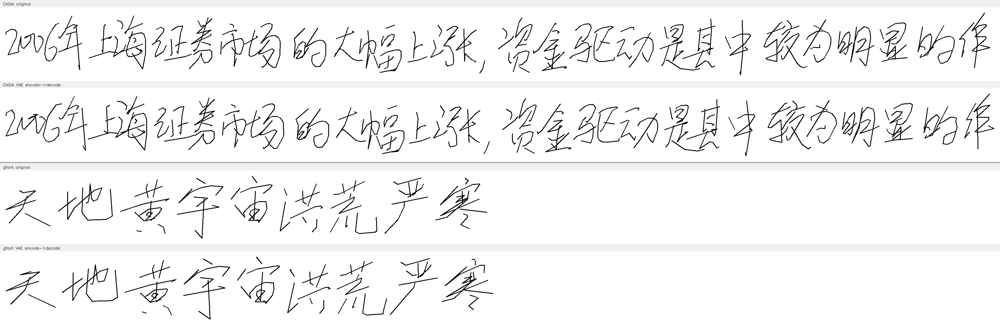

# DiffInk 数据格式与 gfont 转换说明

## 1. DiffInk 训练数据格式（CASIA-OLHWDB）

### 1.1 数据来源

DiffInk 训练数据来自 **CASIA-OLHWDB**（中国科学院自动化研究所在线手写数据库）。数据通过**手写板设备**实时录制，记录书写者连续书写一整行文字时的笔尖轨迹。

论文: [DiffInk: Glyph- and Style-Aware Latent Diffusion Transformer](https://arxiv.org/pdf/2509.23624) (ICLR 2026)

### 1.2 存储格式

HDF5 文件（`val.h5`），每条样本包含：

| 字段 | 类型 | 说明 |
|------|------|------|
| `point_seq` | float32 [T, 5] | 笔迹序列，5列五元组 |
| `char_points_idx` | int[] | 每个字符边界过渡点的索引 |
| `line_text` | string | 对应的文字内容 |
| `writer_id` | string | 书写者 ID |

### 1.3 五元组定义

每个点 `[x, y, is_next, is_new_stroke, is_new_char]`：

| 列 | 名称 | 含义 |
|----|------|------|
| 0 | x | 笔尖 x 坐标（数学坐标系，向右为正） |
| 1 | y | 笔尖 y 坐标（数学坐标系，向上为正） |
| 2 | is_next | 1=继续画线到下一点, 0=当前笔段结束（不画线到下一点） |
| 3 | is_new_stroke | 1=标记笔画结束（与 is_next=0 同时出现在同一个点上） |
| 4 | is_new_char | 1=标记字符结束（与 is_next=0 同时出现在同一个点上） |

### 1.4 三种 flags 模式

| 模式 | flags (is_next, is_new_stroke, is_new_char) | 含义 |
|------|---------------------------------------------|------|
| 正常画线 | `(1, 0, 0)` | 从当前点画线到下一个点 |
| 笔画内抬笔 | `(0, 1, 0)` | 当前笔画最后一点，不画线到下一点 |
| 字符结束 | `(0, 0, 1)` | 当前字符最后一点，不画线到下一点 |
| 填充/padding | `(0, 0, 1)` | 序列末尾的填充（坐标为 0,0） |

### 1.5 字符边界的完整结构

每个字符边界由**两个连续的点**组成：

```
[idx  ] x1, y1, 0, 0, 1    ← 字符结束标记（char_end marker）
[idx+1] x2, y2, 1, 0, 0    ← 过渡点（char_points_idx 指向这里）
```

`char_points_idx` 指向的是 marker **后面**那个点（idx+1），该点的坐标是**下一个字符的起始位置附近**（不一定和 marker 相同）。

**验证数据**（CASIA 样本）：

| 字符 | char_end marker | char_points_idx | marker 坐标 | cpi 点坐标 | 坐标相同? |
|------|----------------|-----------------|-------------|-----------|----------|
| "2" | 8 | 9 | (-44.42, -0.41) | (-44.42, -0.41) | 是 |
| "0" | 20 | 21 | (-43.16, 0.88) | (-43.16, 0.88) | 是 |
| "0" | 31 | 32 | (-42.60, 0.72) | (-40.90, 1.82) | 否 |
| "6" | 45 | 46 | (-41.76, -0.42) | (-39.76, 2.45) | 否 |

关系: `char_points_idx[i] = char_end_marker_index[i] + 1`（始终成立）

### 1.6 示例——完整的字符边界过程

```
... 字符 "年" 的笔画 ...
[ 63] x=-39.079 y=-2.261  (1, 0, 0)    ← 正常画线
[ 64] x=-39.178 y=-1.864  (0, 0, 1)    ← 字符结束标记 ★
[ 65] x=-36.812 y= 1.726  (1, 0, 0)    ← char_points_idx[4]=65 指向此处
[ 66] x=-36.945 y= 1.527  (1, 0, 0)    ← 下一个字 "上" 的第二个点
...
```

### 1.7 数量级统计

| 指标 | 值 |
|------|-----|
| 每字平均点数 | 25.9（最少 3，最多 49） |
| 每字平均笔画数 | 4.5（最少 1，最多 9） |
| 每字 x 宽度 | 平均 3.36（范围 1.04 ~ 5.03） |
| 每字 y 高度 | 平均 3.67（范围 1.26 ~ 4.80） |
| 相邻点距离 | 平均 0.826，中位 0.602，最大 5.258 |
| 字间过渡距离 | 0.1 ~ 1.4 |
| 全局 x 范围 | -45.53 ~ 43.28（跨度 88.81） |
| 全局 y 范围 | -2.72 ~ 2.72（跨度 5.44） |

---

## 2. gfont 数据格式

### 2.1 数据来源

`.gfont` 是 ZIP 压缩的字体文件，包含手写字体的字形坐标。每个字符独立存储。

### 2.2 二进制格式（.gfont 内的单字文件）

| 字段 | 字节数 | 类型 | 说明 |
|------|--------|------|------|
| unicode | 2 | uint16 BE | Unicode 码点 |
| num_coords_x2 | 4 | uint32 BE | 坐标值个数 = 2 × 点数 |
| coordinates | 8 × n | float32 BE | n 个 (x, y) 坐标对 |
| length_check | 4 | uint32 BE | 校验值 = n |
| pen_down_flags | n | uint8 | 0=抬笔, 1=落笔 |

### 2.3 JSON 预解析格式

```json
{
  "char_count": 6907,
  "characters": [
    {
      "unicode": 22825,
      "character": "天",
      "strokes": [
        [[-29, -105], [-10, -109], [41, -137], ...],
        [[-83, -47], [-67, -52], [11, -85], ...],
        [[47, -131], [-15, -55], [-73, 3]]
      ]
    }
  ]
}
```

### 2.4 关键特征

- **坐标系**: 屏幕坐标系（y 向下为正，与 CASIA 的数学坐标系相反）
- **字符独立**: 每个字符有自己的坐标空间，字符间无关联
- **坐标范围**: 单字约 150~210（x）× 135~226（y），远大于 CASIA 的 2~5

### 2.5 数量级（严寒_kvenjoy 字体）

| 指标 | 值 |
|------|-----|
| 总字符数 | 6907 |
| 每字点数 | 24 ~ 59，平均 40.2 |
| 每字笔画数 | 2 ~ 9，平均 5.8 |
| 单字坐标范围 | x: ~150~210, y: ~135~226 |

---

## 3. 转换过程：gfont → DiffInk 五元组

### 3.1 转换需要解决的三个问题

| 问题 | gfont 现状 | CASIA 目标 |
|------|-----------|-----------|
| y 轴方向 | 屏幕坐标系（y 向下） | 数学坐标系（y 向上） |
| 字符排列 | 各字独立，无相对位置 | 水平一行排列 |
| 坐标范围 | 单字 ~200 单位 | 全局 ~5 单位 (y) |

### 3.2 转换步骤（共 5 步）

#### Step 1: 读取笔画 + y 轴翻转

从 gfont JSON 中取出目标字符的 strokes，将 y 坐标取负（屏幕坐标 → 数学坐标）。

```python
x = stroke[pi, 0] - x_min    # x 归零到字符左边缘
y = -stroke[pi, 1]            # ★ y 轴翻转
```

#### Step 2: 生成五元组 flags

| 点的位置 | flags |
|---------|-------|
| 笔画内普通点 | `(x, y, 1, 0, 0)` |
| 笔画最后一点（非字末） | `(x, y, 0, 1, 0)` |
| 字符最后一笔最后一点 | `(x, y, 0, 0, 1)` ← 字符结束标记 |

#### Step 3: 水平拼接各字

各字的 x 加上累计偏移量，字间间距 30（原始坐标单位）。

```
天: x_offset=0     → x 范围 [0, 168]
地: x_offset=198   → x 范围 [198, 404]
...
```

#### Step 4: 插入字符边界过渡点

在每个字符的 `(0, 0, 1)` 标记后面，插入一个过渡点 `(1, 0, 0)`：

- 非最后一个字: 过渡点坐标 = **下一个字的第一个点坐标**
- 最后一个字: 过渡点坐标 = 重复当前字最后一点

`char_points_idx` 记录每个过渡点的索引。

```
[23] x=3.55 y=-1.50  (0, 0, 1)    ← "天" 结束标记
[24] x=4.21 y=-0.31  (1, 0, 0)    ← 过渡点 = "地"的第一个点坐标
                                     char_points_idx[0] = 24
[25] x=4.21 y=-0.31  (1, 0, 0)    ← "地" 的第一个点（和过渡点坐标相同）
```

这样 `plot_line_cv2` 从过渡点画线到下一个点时距离为 0，不会出现跨字连线。

#### Step 5: 全局等比缩放

```python
scale = 5.0 / (y_max - y_min)
x *= scale
y *= scale
y -= (y_max + y_min) / 2    # y 居中到 0
```

缩放后坐标范围: x=[0, ~43], y=[-2.5, 2.5]，与 CASIA 一致。

### 3.3 转换前后数据对比

| 指标 | CASIA（训练数据） | gfont（转换后） |
|------|-------------------|-----------------|
| 总点数 | 802（31字） | 412（10字） |
| 每字平均点数 | 25.9 | 40.2 |
| 每字平均笔画数 | 4.5 | 5.8 |
| 每字 x 宽度 | 平均 3.36 | 平均 3.71 |
| 每字 y 高度 | 平均 3.67 | 平均 3.95 |
| x 全局范围 | [-45.53, 43.28] | [0, 42.87] |
| y 全局范围 | [-2.72, 2.72] | [-2.50, 2.50] |
| (0,0,1) char_end 标记数 | 31 | 10 |
| char_points_idx 与 marker 关系 | cpi = marker + 1 ✓ | cpi = marker + 1 ✓ |
| 字间过渡连线距离 | 0.1 ~ 1.4 | 0（过渡点 = 下一字起点） |

### 3.4 渲染验证

转换后的数据用 DiffInk 自带的 `plot_line_cv2` 渲染（与模型推理输出使用相同的渲染函数），每个字清晰可辨。

**CASIA 训练数据渲染**（`plot_line_cv2`，原始 val.h5 数据）：



> "2006年上海证券市场的大幅上涨,资金驱动是其中较为明显的作用"

**gfont 转换后渲染**（`plot_line_cv2`，同一渲染函数）：



> "天地黄宇宙洪荒严寒永"（最后一个"永"被 `plot_line_cv2` 的裁剪逻辑截掉，不影响模型输入）

两份数据使用完全相同的渲染方式，字形均清晰可辨，说明转换格式正确。

### 3.5 DiffInk 推理效果

用转换后的 gfont 数据作为 style reference 输入 DiffInk 模型（前 5 字 "天地黄宇宙" 作为风格参考，生成后 5 字 "洪荒严寒永"）：



> 上: gfont 转换后的输入（`plot_line_cv2` 渲染）
> 下: DiffInk 模型输出（同一渲染函数）

生成效果不理想——style 区域（前 5 字）部分保留了字形，但生成区域（后 5 字）质量明显下降。

---

## 4. 问题定位：VAE vs DiT

为了定位生成效果差的原因，分别测试了 DiffInk 的两个子模块：

### 4.1 VAE 编解码测试（无生成）

将数据只通过 VAE encode→decode 一个往返，不经过 DiT 扩散生成，看 VAE 能否正确重建输入：



> 第 1 行: CASIA 原始输入
> 第 2 行: CASIA 经 VAE 编解码重建
> 第 3 行: gfont 原始输入
> 第 4 行: gfont 经 VAE 编解码重建

**结论: VAE 对 gfont 数据的编解码完全正确**，重建质量与 CASIA 相当。说明数据格式转换没有问题，VAE 能正确理解 gfont 数据。

### 4.2 完整推理对比（VAE + DiT）

| 测试 | 输入数据 | VAE 编解码 | DiT 生成 | 最终效果 |
|------|---------|-----------|---------|---------|
| CASIA 原始数据 | ✅ 正确 | ✅ 完美重建 | ✅ 生成质量好 | ✅ 好 |
| gfont 转换数据 | ✅ 正确 | ✅ 完美重建 | ❌ 生成质量差 | ❌ 差 |

### 4.3 根因分析

问题出在 **DiT（扩散 Transformer）** 阶段：

1. **VAE 能正确编解码 gfont 数据**，但编码出的 latent 向量分布与 CASIA latent 分布不同
2. **DiT 仅在 CASIA latent 分布上训练过**，当接收到 gfont latent 作为前缀条件时，生成的后续 latent 质量下降
3. 这是**模型泛化能力**的问题，不是数据格式的问题

### 4.4 解决方向

- **微调 DiT**: 在 gfont 数据转换后的 latent 上微调 DiT，使其学会 gfont latent 分布
- **混合训练**: 在 CASIA + gfont 混合数据上重新训练 DiT
- **域适应**: 训练一个 latent 空间映射网络，将 gfont latent 映射到 CASIA latent 分布

---

## 5. 转换代码

转换工具: `gfont_to_diffink.py`

### 5.1 快速使用

```bash
# 从 JSON 预解析文件转换
python gfont_to_diffink.py \
    --json 严寒_kvenjoy_严寒.json \
    --chars "天地黄宇宙洪荒严寒永" \
    --num_style 5 \
    --output test_input.json

# 从 .gfont 文件转换
python gfont_to_diffink.py \
    --gfont 严寒_kvenjoy_严寒.gfont \
    --chars "天地黄宇宙洪荒严寒永" \
    --num_style 5
```

### 5.2 作为模块使用

```python
from gfont_to_diffink import load_gfont_json, gfont_to_diffink, make_diffink_input

# 加载字体
font_data = load_gfont_json("严寒_kvenjoy_严寒.json")

# 转换
point_seq, char_points_idx = gfont_to_diffink(
    chars="天地黄宇宙洪荒严寒永",
    font_data=font_data,
)

# 生成 DiffInk 输入
payload = make_diffink_input(
    point_seq, char_points_idx,
    reference_text="天地黄宇宙洪荒严寒永",
    target_text="洪荒严寒永",
    num_style_chars=5,
)
```

### 5.3 注意事项

1. **词汇表限制**: DiffInk 词汇表 (`All_zi.json`) 包含 2648 个字符，不在词汇表中的字符无法生成。转换前需检查目标字符是否在词汇表中。

2. **字符数量**: 建议 10~30 个字符，其中 style 参考 5~10 个。过少则模型缺少风格信息，过多则序列太长。

3. **字间间距**: 默认 30（原始坐标单位），缩放后约 0.6~1.0。可通过 `--char_gap` 调整。

---

## 6. 相关文件

| 文件 | 说明 |
|------|------|
| `gfont_to_diffink.py` | gfont → DiffInk 转换工具（本文档配套代码） |
| `test_local.py` | DiffInk 本地推理脚本 |
| `test_input.json` | CASIA 原始数据样本（val.h5 提取） |
| `test/test_input_v3.json` | gfont 转换后的最终版本 |
| `test/test_outputs_v3/` | 最终转换的渲染验证结果 |
| `test/test_outputs_compare/` | CASIA vs gfont 对比图 |
